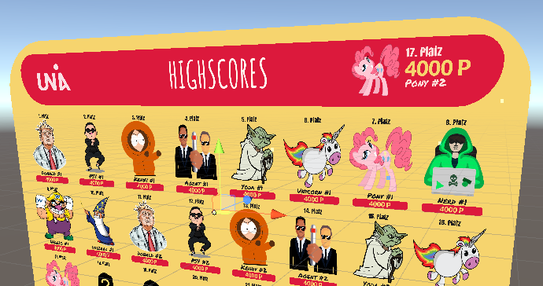
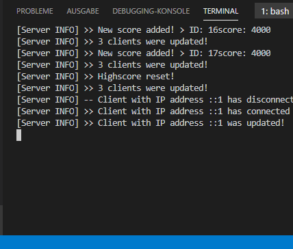
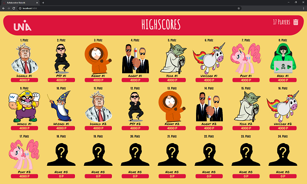
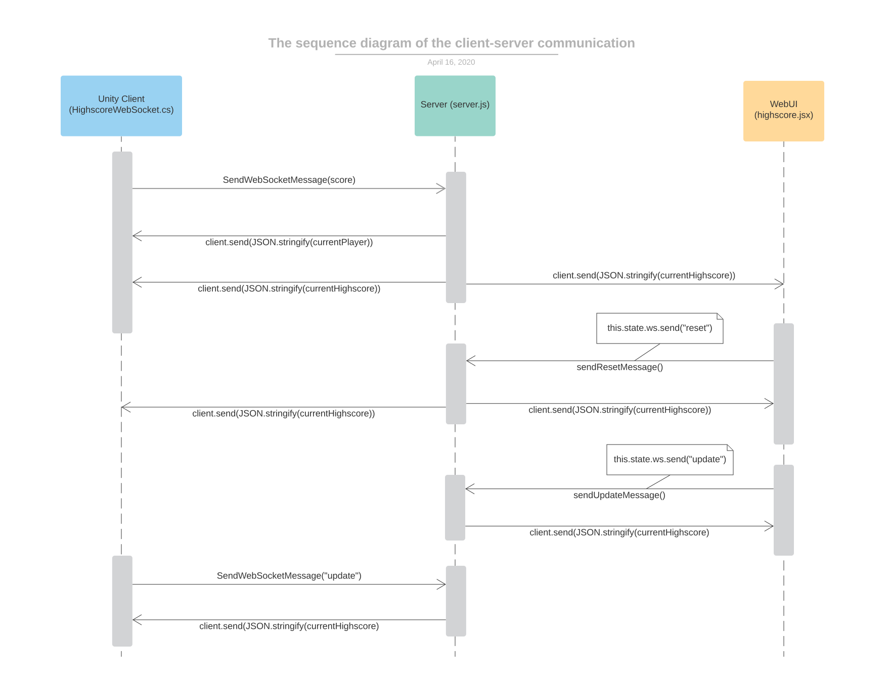
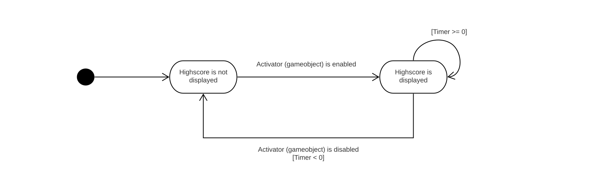
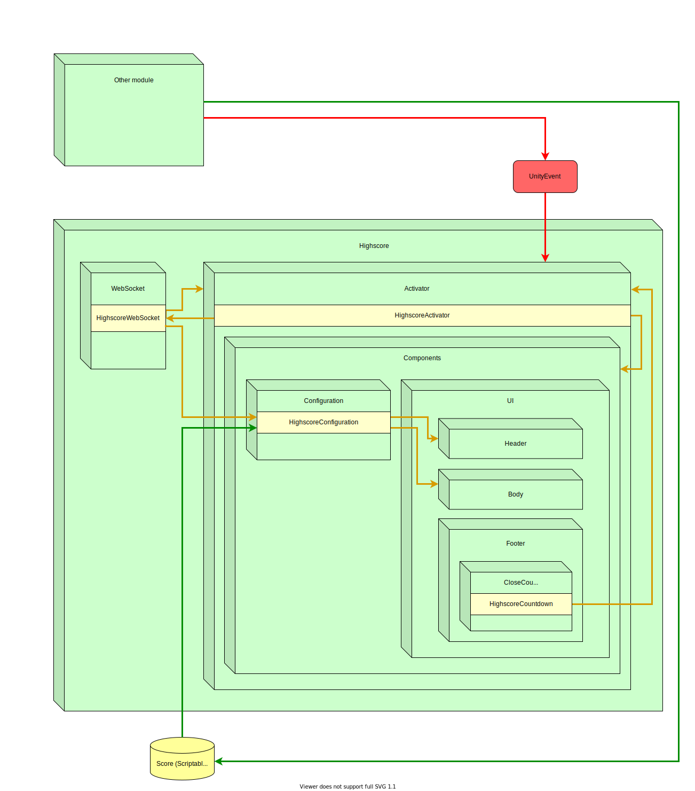

Highscore for AR headsets (HoloLens)
====
The following highscore can be viewed on the Hololens and in a web browser. The Mixed Reality Toolkit was used in Unity for this purpose. For the creation of the web client the technologies React, Sass (Syntactically Awesome Style Sheets) and webpack were used. For the communication between the clients and the creation of the highscore table a Javascript server is used.


## 1. Preview

| Unity Client (HoloLens)   | Server           | WebUI  |
| ------------- |-------------| -----|
|       |  |  |
| On the highscore for the HoloLens you can see the current highscores of the best 24 players and your own achieved score. |In the console all communication processes between the server and the client can be tracked. | In the browser you can see the current highscores of the best 24 players and the number of all players. You can also reset the highscore in this window.|


| Demo   |
|-------------| 
|    |


## 2. The client-server communication
Below you can see a sequence diagram showing the communication between the clients (Unity and WebUI) and the server.




### 2.1 Types of messages
Different types of messages can be sent to the server, which messages these are and from which clients the respective messages are sent, is explained in the following.
#### 2.1.1 Unity Client
The Unity client can send two types of messages to the server:
- **Score message:** It can send the server a score, after that it receives two messages from the server. The first message contains information about the player created by the server and the second message contains the current highscore list. All other clients also receive the current highscore from the server!
- **Update message:** If the client sends an udpate message to the server, it receives a message with the current list from the server (only the client that sent the "update message" gets the highscore from the server!)
#### 2.1.2 WebUI
The WebUI can also send two types of messages to the server:
- **Reset message:** When the client sends a reset message to the server, the highscore is reset to its default values and all other clients are notified and receive the current highscore from the server.
- **Update message:** See unity client


### 2.2 WebSocket connection
A WebSocket connection is established by a client (Unity or HoloLens) as soon as the scene in which the highscore is located is running. The websocket connection between server and client is maintained as long as the scene is active (even if the highscore is not displayed). This means that the connection is independent of the highscore display and runs in the background. The websocket connection is only disconnected if **one of the following 3 conditions** is met:
- **The client switches to another scene**
- **The main application is terminated**
- **Server goes offline** (client trying to establish a connection)

## 3. Lifetime of the GUI (HoloLens)
The following state diagram shows the lifecycle of the highscore on the HoloLens.



You can see from the state diagram that the highscore is displayed as soon as the game object "Activator" (a child object of the highscore object) is activated. If this happens, a timer is started and the activator will be deactivated as soon as it has expired.


## 4. Overview of the GUI (HoloLens)
The following overview shows the dependencies of all objects and events of the GUI in context of a project.




## 5. How to use
For the operation of the two clients and the server a few things are needed, which are explained below.

### 5.1 Requirements
- **Unity** (v2019.2.13f1)
- **Microsoft Mixed Reality Toolkit** (v2.2.0)
- **Node.js** (v12.16.1)
- **NPM** (v6.14.4)

### 5.2 Installation
#### First Steps
- Edit the file **highscore.jsx** with your ip address (server):
```javascript
ws: new WebSocket("ws://YOUR IP ADDRESS:3030")
```
- Edit the file **HighscoreWebSocket.cs** with your ip address (server):
```csharp
websocket = new WebSocket("ws://YOUR IP ADDRESS:3030");
```
- Make sure that your firewall **does not block** the communication between clients and server!
#### Next Steps
- **WebUI:** Go to the folder **Highscore/WebUI** and install the web client with the command "**npm install**".
  - After the installation the web ui can be started with the command "**npm run server**".

- **Server:** Go to the folder **Highscore/Server** and install the server with the command "**npm install**".
  - After the installation the server can be started with the command "**npm start**".
  
- **Unity/AR Client:** Drag and drop the highscore prefab into your scene (in Unity)
  1. Set the value of the Scriptable Object (SimpleFloatValue), which was set in the configuration to the desired value.
  2. Enable the Activator gameobject (child object from highscore)
  3. If the server is running, you have now added the first value to the highscore list
